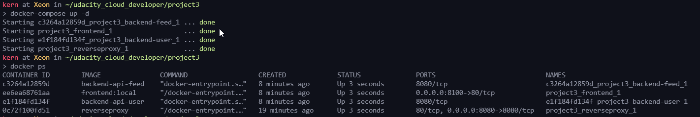
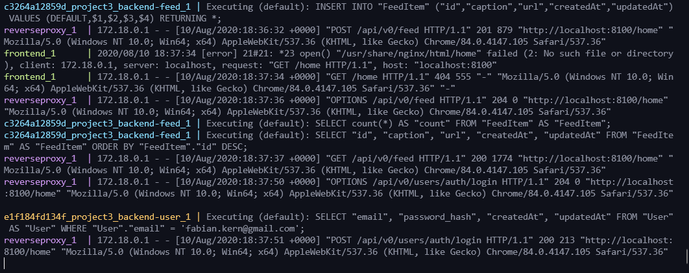
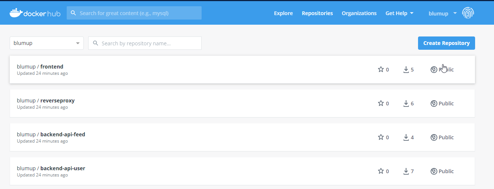
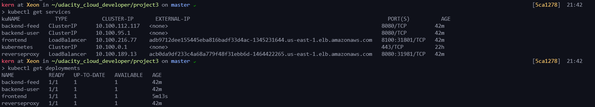
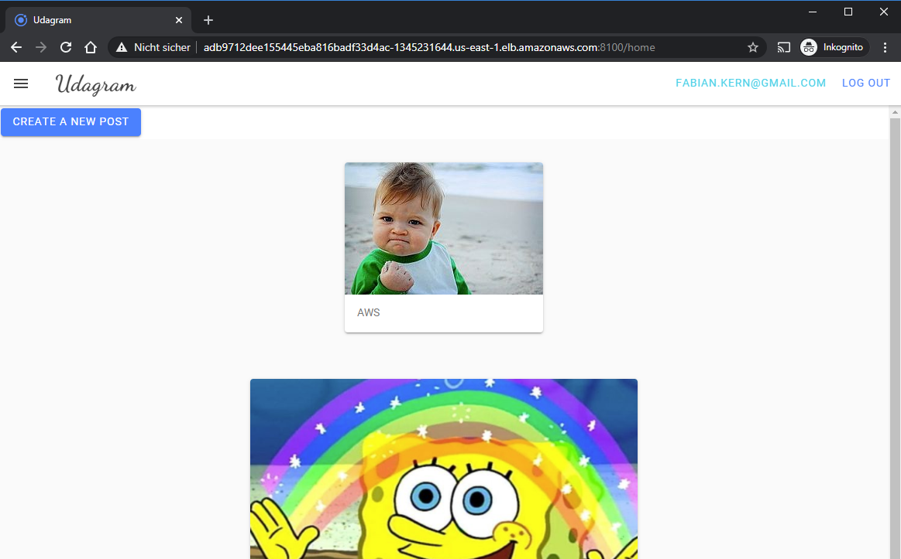

# Cloud Developer Nanodgree

## Project: Refactor Udagram Project

Date: 10.08.2020

## Monolith to Microservices

Starting from a *monolith* of 

1. API module and

2. Frontend

we are able to refactor the projcet to yield *microservices* split into the following containers:

1. **Feed-API** with endpoint `/feed/` 

2. **User-API** with endpoint `/auth/` 

3. **Frontend** consisting of a [angular](https://angularjs.org/) web application built with the [ionic](https://ionicframework.com/docs/angular/overview) framework

4. **Reverse Proxy** (using [NGINX](https://www.nginx.com/)) to bridge between the frontend and different api endpoints

## Prerequisites within AWS

- **S3** bucket for data storage

- **PostgresDB** for feed content and user metadata

- **EKS Cluster** for running the docker containers

### Local Built & Execution via Docker Compose

The four microservices listed before could be spawned up individually but to simplify orchestration `docker compose` is used. Thereby, we are able to have a *multi-container solution* built and started with a single command.

```bash
docker-compose build # build docker images
source set_env.sh # read env variables
docker-compose up -d # run multi-container app - detached
```

Runnig docker containers:



Application:


With log output on the terminal via stdout:



## Final Pipeline (Travis CI - Docker Hub - K8)

Github Repo / Source Code: [GitHub - bijzz/udacity_refudagran](https://github.com/bijzz/udacity_refudagran)

TravisCI Repo / Continous Integration: [Docker Hub - blumup](https://hub.docker.com/u/blumup)

### GitHub

All the source code is checked into the repository at [GitHub - bijzz/udacity_refudagran](https://github.com/bijzz/udacity_refudagran)


### TravisCI

Each commit to GitHub triggers a build in TravisCI.

TravisCI will built all docker images and automatically push them to DockerHub [Docker Hub - blumup](https://hub.docker.com/r/blumup/)


### DockerHub



### AWS EKS

Configure kubectl to use the AWS cluster:

```bash
# add eks cluster to kubectl contexts
aws eks --region us-east-1 update-kubeconfig --name Udagram 
# see available clusters / contexts
kubectl config get-clusters
kubectl config get-contexts
kubectl config current-context     
kubectl config use-context <specify_context>
```

Deployment

```bash
# for deployment
kubectl apply -f k8/ 
```

Watching the status:



Notes:

- The kubectl can be inlcuded with TravisCI for triggering a full continous deployment pipeline.

- K8 itself allows rolling upgrades by simply redeploying changed configuration files / yamls.

### Application


